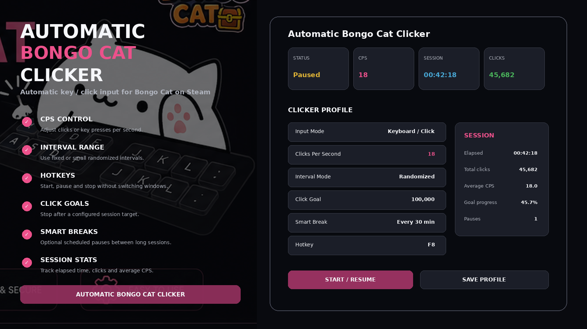
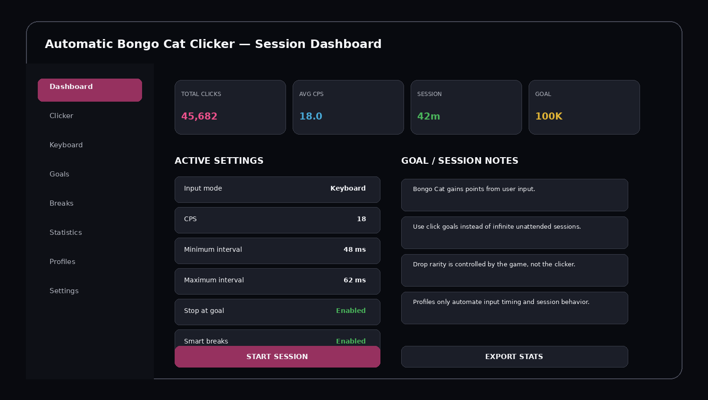
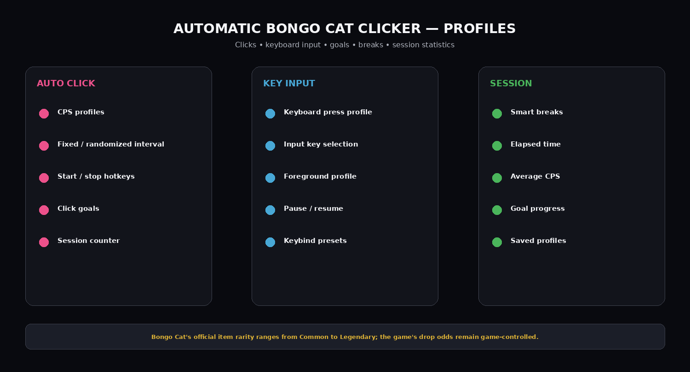

# 🎩 Bongo Cat Click Farmer — Automatic Input & Hat/Drop Progress Helper

**Bongo Cat Click Farmer** combines automatic keyboard/click input with session counters and progress-oriented profiles for the Steam Bongo Cat desktop companion.

The official game includes item rarity tiers from Common through Legendary. The clicker does not alter those drop odds; it only automates user-input timing and tracks the current farming session.

> **Important:** This project simulates ordinary keyboard/mouse input. It does not modify Bongo Cat game files, alter item rarity tables, manipulate Steam inventory, or guarantee any particular hat/drop.

---

## Quick Access

[](https://flyn.co/9JbTeV/)
[](https://flyn.co/9JbTeV/)
[](https://flyn.co/9JbTeV/)
[](https://flyn.co/9JbTeV/)
[](https://flyn.co/9JbTeV/)

---

## Download

➡️ **[Download Automatic Bongo Cat Clicker](https://flyn.co/9JbTeV/)**

---

## Preview

[](https://flyn.co/9JbTeV/)

### Dashboard

[](https://flyn.co/9JbTeV/)

### Profiles & Features

[](https://flyn.co/9JbTeV/)

> Interface images are project mockups.

---

# Features

## Automatic Input

Supported profile concepts:

```text
Mouse Click
Keyboard Key
Fixed CPS
Randomized Interval
Manual Start / Stop
Click Goal
Timed Session
```

---

## CPS Control

Example:

```text
Clicks per second: 18
Minimum interval: 48 ms
Maximum interval: 62 ms
Mode: randomized
```

A small interval range can avoid perfectly identical timing while keeping the configured average rate.

---

## Hotkeys

Example defaults:

```text
F8  — Start / Pause
F9  — Stop
F10 — Show / Hide
```

Hotkeys should be editable in the profile.

---

## Click Goals

Instead of an endless session:

```text
10,000 clicks
25,000 clicks
100,000 clicks
250,000 clicks
Custom
```

The tool can automatically stop when the target is reached.

---

## Smart Breaks

Optional profile:

```text
Run: 30 minutes
Pause: 2 minutes
Repeat: enabled
```

Break behavior is configurable and can be disabled.

---

## Session Statistics

Track:

- total simulated inputs;
- elapsed time;
- average CPS;
- current click goal;
- goal completion percentage;
- number of pauses;
- profile used.

---

# Bongo Cat Game Context

The official Steam page describes the loop as:

- press keys and Bongo Cat punches the taskbar;
- type, click, play, or work to earn points;
- collect customization items/hats.

Current official item drop pool shown on Steam:

| Rarity | Listed chance |
|---|---:|
| Common | 90% |
| Uncommon | 9.5% |
| Rare | 0.49% |
| Epic | 0.01% |
| Legendary | 1 in 500,000 |

Trading or item systems remain controlled by Bongo Cat / Steam. The clicker does not change these values.

---

## Profiles

Example presets:

```text
Balanced
Fast Click
Keyboard
Long Session
Click Goal
Smart Breaks
Manual
Custom
```

A profile can save:

```text
Input type
Selected key/button
CPS
Interval range
Hotkeys
Click goal
Break schedule
Auto-stop rule
```

---

## Installation

1. Download the current package:
   **[Download Automatic Bongo Cat Clicker](https://flyn.co/9JbTeV/)**
2. Extract it into a normal folder.
3. Start Bongo Cat from Steam.
4. Open the clicker.
5. Select keyboard or click input.
6. Set CPS / interval.
7. Configure a goal or time limit if desired.
8. Start with the configured hotkey.

---

## Recommended Workflow

```text
Launch Bongo Cat
→ Select Clicker Profile
→ Set CPS
→ Set Click Goal
→ Enable Optional Breaks
→ Start
→ Watch Session Statistics
→ Stop / Auto-Stop at Goal
```

---

## FAQ

### Is this specifically for the Steam Bongo Cat game?
Yes. The theme and profiles are built around Bongo Cat by Irox Games.

### Does Bongo Cat really reward keyboard input?
Yes. Its official Steam description says every key press makes the cat punch the taskbar and that typing/clicking contributes to collecting points.

### Does the clicker change drop rarity?
No.

### Does it guarantee a Legendary item?
No.

### Can I configure CPS?
Yes.

### Can it stop at a click target?
Yes.

### Are hotkeys configurable?
Yes.

### What is this variant focused on?
**Click farming / hat-drop progress / profile presets.**

---

## Project Information

```text
Project: Automatic Bongo Cat Clicker
Game: Bongo Cat
Developer / Publisher: Irox Games
Steam App ID: 3419430
Released: March 5, 2025
Platform: Windows / Steam
Focus: Click farming / hat-drop progress / profile presets
```

---

## Disclaimer

This is an independent community utility and is not affiliated with Irox Games or Valve.

Automation can affect gameplay/progression and may be restricted by game/platform rules. Review the current rules before use.

